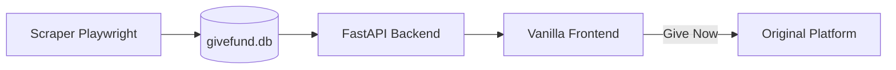

# GiveFund

**Every campaign. One place.**

GiveFund is a public-service site that lets donors search crowdfunding campaigns across [GoFundMe](https://www.gofundme.com), [LaunchGood](https://www.launchgood.com), and [Fundly](https://fundly.com) in one place — then donate on the original platform. No accounts, no fees, no monetization.

Repository: [github.com/ammar-adam/givefund](https://github.com/ammar-adam/givefund)

## How it works



| Layer | Tech | Role |
|-------|------|------|
| Scraper | Python, Playwright, aiosqlite | Discovers campaigns, upserts into SQLite |
| Backend | FastAPI, aiosqlite | Read-only REST API |
| Frontend | HTML/CSS/JS (single file) | Search, filter, browse, deep-link out |

## Quick start

1. Copy environment file:

   ```bash
   cp .env.example .env
   ```

2. Seed data and start API:

   ```bash
   cd scraper && pip install -r requirements.txt && python seed_db.py
   cd ../backend && pip install -r requirements.txt && uvicorn main:app --reload
   ```

3. Open `frontend/index.html` in your browser (ensure `API_URL` matches your backend).

For live scraping, install Chromium: `playwright install chromium`, then `python main.py --platform all` from `scraper/`.

See **[HANDOFF.md](./HANDOFF.md)** for full commands, deployment, and next steps.

## API

| Endpoint | Description |
|----------|-------------|
| `GET /campaigns` | Search, filter, sort, paginate |
| `GET /campaigns/{id}` | Single campaign |
| `GET /categories` | Distinct categories |
| `GET /platforms` | Distinct platforms |
| `GET /stats` | Totals and last scraped time |
| `GET /health` | Status and row count |

## Branches

- `agent/scraper` — scraper work
- `agent/backend` — API work
- `agent/frontend` — UI work
- `main` — integrated default branch

## License

Public service project — use and extend for social good.
